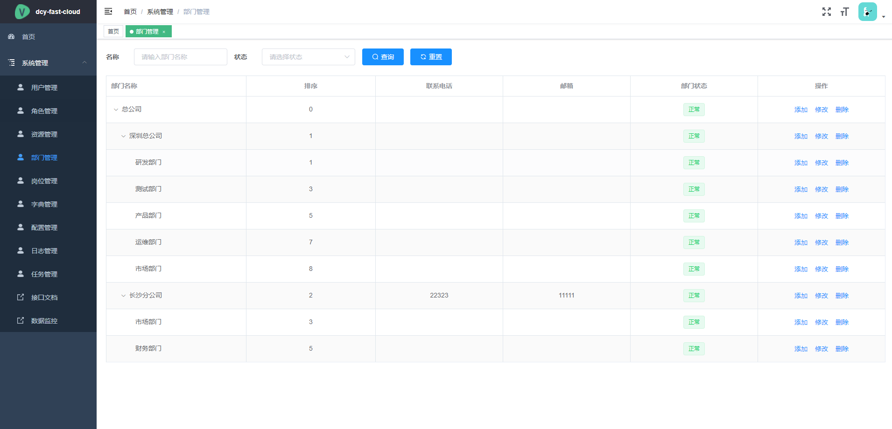

# dcy-fast
个人，毕业设计学习使用。
## 平台简介

一直想做一款后台管理系统，看了很多优秀的开源项目但是发现没有合适的。于是利用空闲休息时间开始自己写了一套后台系统。参考若依框架，自己编写dcy-fast框架。
她可以用于所有的Web应用程序，如网站管理后台，网站会员中心，CMS，CRM，OA。所有前端后台代码封装过后十分精简易上手，出错概率低。同时支持移动客户端访问。系统会陆续更新一些实用功能。

dcy-fast是一套全部开源的快速开发平台，毫无保留给个人及企业免费使用。

* 感谢**若依**，请移步[RuoYi](https://gitee.com/y_project/RuoYi)
* 感谢 [vue-element-admin](https://github.com/PanJiaChen/vue-element-admin) 后台主题 UI 框架。
* 接口访问地址：[http://localhost:8999/doc.html](http://localhost:8999/doc.html)
    * 用户名：admin；密码：123456

## dcy-fast生态

* **dcy-fast单体**，请移步[dcy-fast](https://gitee.com/dcy421/dcy-fast)
* **dcy-fast-vue前端**，请移步[dcy-fast-vue](https://gitee.com/dcy421/dcy-fast-vue)
* **dubbo 2.7.8 微服务版本dcy-fast-cloud**，请移步[dcy-fast-cloud](https://gitee.com/dcy421/dcy-fast-cloud)
* **dubbo 2.7.8 微服务版本dcy-fast-cloud-vue前端**，请移步[dcy-fast-cloud-vue](https://gitee.com/dcy421/dcy-fast-cloud-vue)

## 技术介绍

|  技术   | 版本  |作用  |
|  ----  | ----  |----  |
| spring boot  | 2.5.4 |版本依赖，快速开发 |
| mybatis-plus  | 3.4.3.4 | 数据库持久层操作工具 |
| mybatis-plus-generator  | 3.4.1 | 代码生成器（controller、service、mapper、xml、entity、dto、dtomapper、vue） |
| sa-token  | 1.28.0 | java鉴权框架 |
| hutool  | 5.7.16 | java工具类 |
| flyway  | 7.7.3 | 数据库迁移工具 |
| knife4j  | 2.0.8 | 接口文档 |
| mapstruct  | 1.4.2.Final | DTO转换工具 |
| druid  | 1.1.21 | 数据库连接池 |
| redisson  | 3.12.5 | 分布式锁 |
| quartz  | 2.3.2 | 定时任务 |
| easypoi  | 4.4.0 | excel导出导入 |
| flowable  | 6.6.0 | 开源工作流 |

## TODO-LIST

1.优化代码（暂无任务了）

## 内置功能

1. 用户管理：用户是系统操作者，该功能主要完成系统用户配置。
2. 部门管理：配置系统组织机构（公司、部门、小组），树结构展现支持数据权限。
3. 岗位管理：配置系统用户所属担任职务。
4. 菜单管理：配置系统菜单，操作权限，按钮权限标识等。
5. 角色管理：角色菜单权限分配、设置角色按机构进行数据范围权限划分。
6. 字典管理：对系统中经常使用的一些较为固定的数据进行维护。
7. 参数管理：对系统动态配置常用参数。
8. 操作日志：系统正常操作日志记录和查询；系统异常信息日志记录和查询。
9. 定时任务：在线（添加、修改、删除)任务调度包含执行结果日志。
10. 代码生成：前后端代码的生成（controller、service、mapper、xml、entity、dto、dtomapper、vue）支持CRUD下载 。
11. 系统接口：根据业务代码自动生成相关的api接口文档。
12. 连接池监视：监视当前系统数据库连接池状态，可进行分析SQL找出系统性能瓶颈。
13. 文件管理：fastDFS和Minio已经都集成。

## 如何运行

1. 准备redis 修改 `application-dev.yml` 里面的配置项
2. 准备mysql 修改 `application-dev.yml` 里面的配置项
    * 注意：__创建数据库，不需要导入表结果，空的数据库即可，因为flyway会自动创建__
3. 如果需要文件上传请选择 `fastdfs`或者`minio` 安装教程网上找即可，如果需要后续我会出文档。
4. `banner.txt` 文件控制台有乱码，可以删除或换成自己喜欢的
5. 修改 `application.yml` 的 `spring.flyway.enabled` 变成 `true`
6. 直接运行 `WebApplication` 即可
7. 访问接口访问地址：[http://localhost:8999/doc.html](http://localhost:8999/doc.html)
    * 用户名：admin；密码：123456

## 数据权限怎么玩
1. 定义mapper 和 sql
```java
/**
 * 分页查询
 *
 * @param page    分页对象
 * @param wrapper 条件参数
 * @return
 */
@DataScope(value = {
        @DataColumn(alias = "userInfo", name = "dept_id")
})
IPage<UserInfo> selectPageList(IPage<UserInfo> page, @Param(Constants.WRAPPER) Wrapper wrapper);
```
```xml
<select id="selectPageList" resultType="com.dcy.system.model.UserInfo">
    select <include refid="Base_Column_List_Alias"/>,
            dept.name as dept_name
    from sys_user_info userInfo left join sys_dept dept on userInfo.dept_id = dept.id
    ${ew.customSqlSegment}
</select>
```
2. service调用
```java
public IPage<UserInfo> pageList(UserInfo userInfo) {
    QueryWrapper<UserInfo> queryWrapper = Wrappers.<UserInfo>query();
    queryWrapper.eq("userInfo." + BaseModel.DEL_FLAG, BaseModelDelFlagEnum.NORMAL.code);
    queryWrapper.like(StrUtil.isNotBlank(userInfo.getUsername()), "userInfo." + UserInfo.USERNAME, userInfo.getUsername());
    if (StrUtil.isNotBlank(userInfo.getDeptId())) {
        queryWrapper.and(userInfoQueryWrapper -> {
                    userInfoQueryWrapper.eq("userInfo." + UserInfo.DEPT_ID, userInfo.getDeptId())
                            .or().inSql("userInfo." + UserInfo.DEPT_ID, "SELECT sys_dept.id FROM sys_dept WHERE FIND_IN_SET('" + userInfo.getDeptId() + "', ancestors)");
                }
        );
    }
    return baseMapper.selectPageList(getPagePlusInfo(userInfo), queryWrapper);
}
```
3. 关键性代码处理
```java
com.dcy.db.base.interceptor.DataPermissionInterceptor#dataPermissionHandler()
```
4. 思路
    * 首先在需要的权限过滤的mapper上面加上`@DataScope`注解，然后添加`@DataColumn`字段，`alias`表示表别名；`name`表示字段名称
    * 然后 `com.dcy.db.base.interceptor.DataPermissionInterceptor#dataPermissionHandler()` 会根据权限自动拼接sql 实现数据过滤
        * `@DataScope`注解 的 `type`字段可以为不同的类型单独处理不同的数据权限，`@DataColumn` 也是一样的逻辑，每个字段都可以单独处理
        * 查询数据权限 `com.dcy.db.base.service.IDataScopeService` 接口


## 工作流使用方式（建议有点基础使用）

1. 先运行项目
2. 在web页面【模型管理】下面新增模型，把oa模块下的 `resources/process-test`下的`请假流程.bpmn20.xml`文件导入进去
3. 然后部署此流程实例
4. 在【流程管理】下 设置审批人，对应功能 `设置审批`，支持角色，人员，部门
5. 可以开始测试了，创建申请，然后查询代办任务，已办任务，追踪流程等待。其他的自己发掘。。。

## 基础功能演示图

<table>
    <tr>
        <td></td>
        <td></td>
    </tr>
    <tr>
        <td></td>
        <td></td>
    </tr>
    <tr>
        <td></td>
        <td></td>
    </tr>
    <tr>
        <td></td>
        <td></td>
    </tr>
    <tr>
        <td></td>
        <td></td>
    </tr>
</table>

## 工作流演示图

<table>
    <tr>
        <td></td>
        <td></td>
    </tr>
    <tr>
        <td></td>
        <td></td>
    </tr>
    <tr>
        <td></td>
        <td></td>
    </tr>
    <tr>
        <td></td>
        <td></td>
    </tr>
    <tr>
        <td></td>
        <td></td>
    </tr>
</table>

## 联系作者

<table>
    <tr>
        <td></td>
    </tr>
</table>
